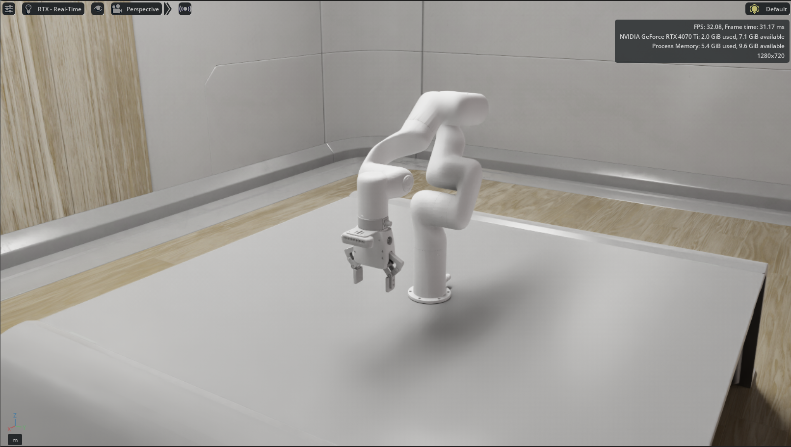

# XArm Isaac Sim Integration



<div align="center">

[](https://developer.nvidia.com/isaac-sim)


[](https://opensource.org/licenses/BSD-3-Clause)
[](https://github.com/gadorneles/xarm_isaac/commits/main)
[](https://github.com/gadorneles/xarm_isaac/issues)
[](https://github.com/gadorneles/xarm_isaac/pulls)
[](https://github.com/gadorneles/xarm_isaac/graphs/contributors)
[](https://github.com/gadorneles/xarm_isaac/stargazers)

</div>

## Overview

This repository provides integration of the UFactory XArm robotic manipulator series with NVIDIA Isaac Sim, along with simple tasks and ROS2 nodes for controlling the robot. It has full compatibility with the MoveIt2 nodes from the [xarm_ros2](https://github.com/xArm-Developer/xarm_ros2) package.

## Installation

### Prerequisites

- [NVIDIA Isaac Sim 5.0.0](https://developer.nvidia.com/isaac-sim)
- [ROS2 Humble](https://docs.ros.org/en/humble/Installation.html)

### Setup

1. **Clone the repository:**
   ```bash
   cd ~/xarm_ws/src
   git clone <repository-url> xarm_isaac
   ```

2. **Build the package:**
   ```bash
   cd ~/xarm_ws
   colcon build --packages-select xarm_isaac
   source install/setup.bash
   ```

## Changelog

### [Unreleased]
- Initial repository setup
- Basic XArm6 USD assets

## Future Goals

- [ ] Support for additional XArm models (XArm5, XArm7)
- [ ] Add full support for RealSense d435i
- [ ] Make ROS2 examples and launchfiles available
- [ ] Implement basic manipulation tasks (pick and place)
- [ ] Isaac Lab integration

## License

This project is licensed under the BSD 3-Clause License - see the [LICENSE](LICENSE) file for details.

## Acknowledgments

- UFactory for the XArm robot series
- NVIDIA for Isaac Sim platform
- ROS2 community for the robotics framework